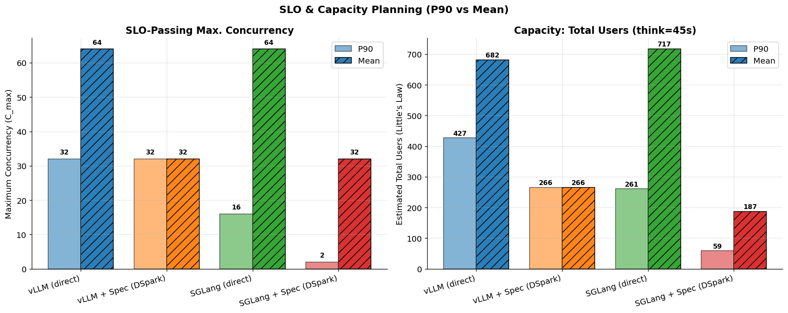
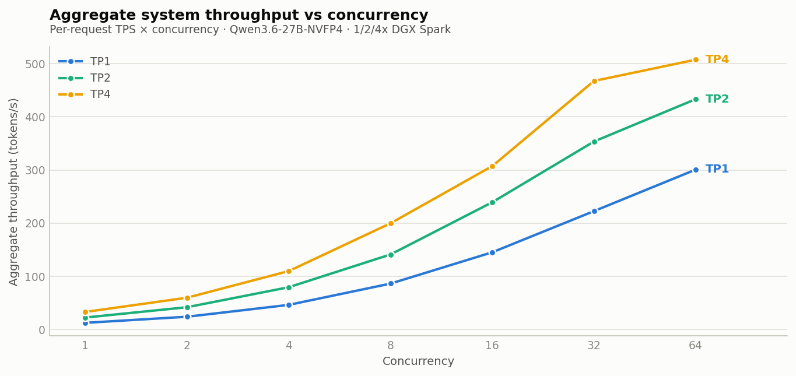
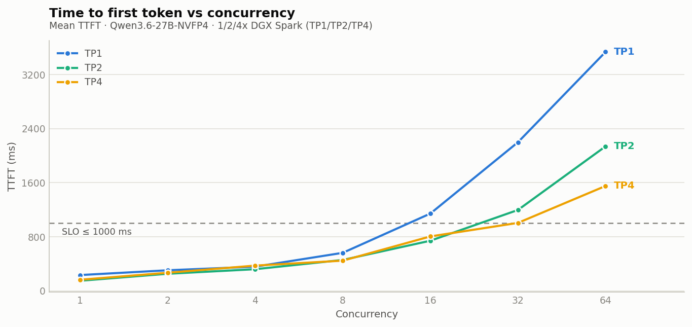
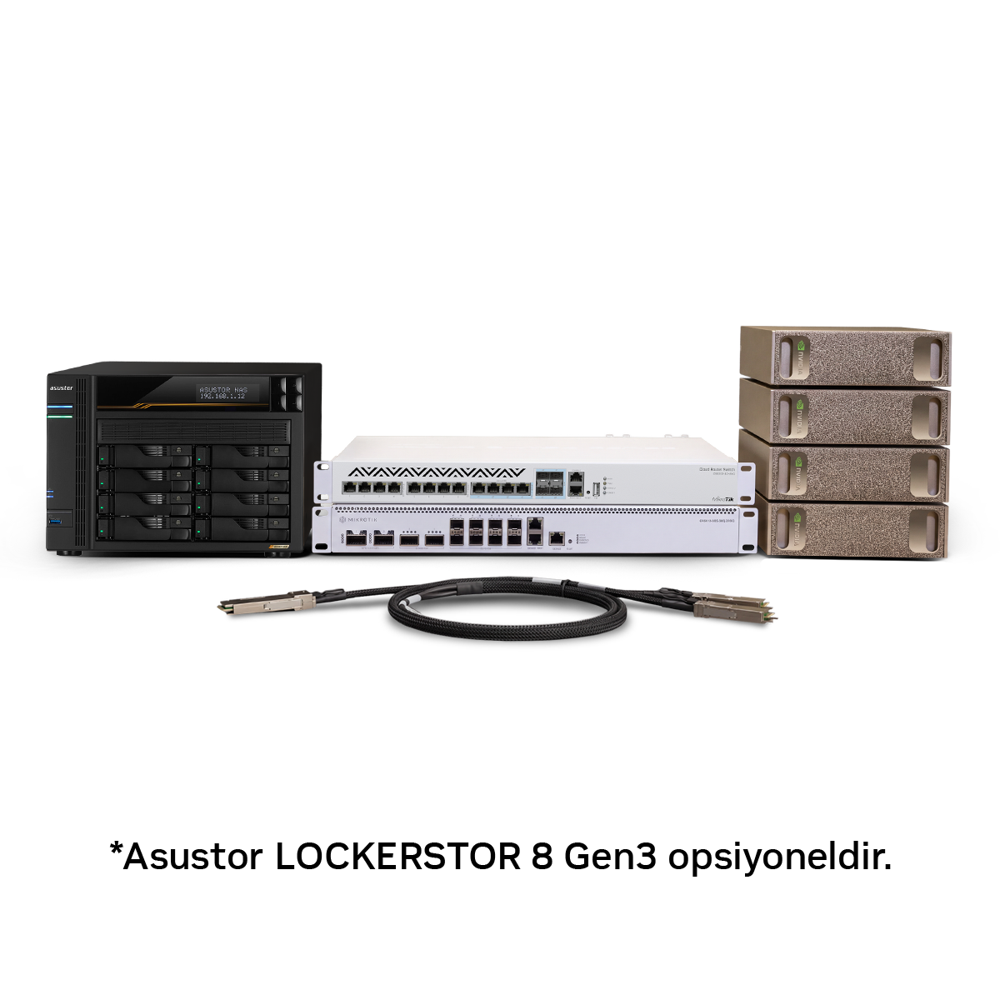
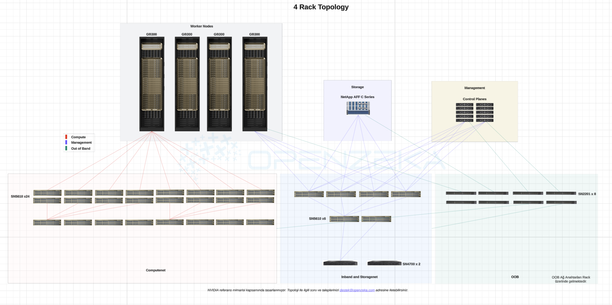

# OpenZeka AI Infrastructure White Papers

**Real hardware. Real workloads. Measured results.**

OpenZeka White Papers is a public collection of hands-on AI infrastructure research, benchmark studies, deployment guides, and architecture analyses produced by OpenZeka.

The work published here is based on systems we **deploy, configure, benchmark, troubleshoot, and operate ourselves**. The goal is to go beyond datasheet specifications and answer practical engineering questions about LLM inference, GPU systems, multi-node scaling, networking, capacity planning, and production AI infrastructure.

**White Papers:** https://whitepapers.openzeka.com/papers/  
**OpenZeka:** https://openzeka.com/en

---

## Research & Engineering Library

Benchmarks, deployment guides, and architecture studies based on real AI infrastructure.

| Title | Topic | Platform |
|---|---|---|
| [Local LLM Usage Guide](https://whitepapers.openzeka.com/papers/yerel-llm-rehberi/) | Hardware → model → software decision guide | Jetson, RTX PRO, DGX Spark, DGX/HGX |
| [NVIDIA DGX B300 vs GB300 NVL72 Cluster Architecture Comparison](https://whitepapers.openzeka.com/papers/b300-gb300-cluster-mimarisi/) | Blackwell Ultra architecture comparison and workload-based platform selection | NVIDIA DGX B300 and GB300 NVL72 |
| [DGX Spark 2-Node AI Cluster Setup Guide](https://whitepapers.openzeka.com/papers/dgx-spark-2node-cluster-kurulumu/) | Point-to-point topology, RoCEv2/RDMA and sparkrun | 2× NVIDIA DGX Spark (GB10) |
| [DGX Spark 3-Node AI Cluster Setup Guide](https://whitepapers.openzeka.com/papers/dgx-spark-3node-cluster-kurulumu/) | Ring/mesh topology, RoCEv2/RDMA and sparkrun | 3× NVIDIA DGX Spark (GB10) |
| [DGX Spark 4-Node AI Cluster Setup Guide](https://whitepapers.openzeka.com/papers/dgx-spark-4node-cluster-kurulumu/) | Switch-based cluster, RoCEv2/RDMA, sparkrun and NAS | 4× NVIDIA DGX Spark (GB10) |
| [DGX Spark 8-Node AI Cluster Setup Guide](https://whitepapers.openzeka.com/papers/dgx-spark-8node-cluster-kurulumu/) | Switch-based cluster, RoCEv2/RDMA, sparkrun and NAS | 8× NVIDIA DGX Spark (GB10) |
| [Qwen3.6-27B DGX Spark Benchmark](https://whitepapers.openzeka.com/papers/qwen3.6-27b-dgx-spark-benchmark/) | LLM quantization comparison: FP8, AWQ, NVFP4 and MTP | NVIDIA DGX Spark (GB10) |
| [Qwen3.6-27B DGX Spark Cluster Scaling](https://whitepapers.openzeka.com/papers/qwen3.6-27b-dgx-spark-scaling/) | Multi-node scaling (TP1/TP2/TP4) and SLO-driven capacity planning | 1× / 2× / 4× NVIDIA DGX Spark (GB10) |
| [DeepSeek-V4.1-Flash 4× DGX Spark Deployment](https://whitepapers.openzeka.com/papers/deepseek-v4.1-flash-4spark-deployment/) | 763B MoE model with TP4: vLLM build chain, SM121 patches, Engram-on-disk, DSpark speculative decoding | 4× NVIDIA DGX Spark (GB10) |
| [DeepSeek-V4.1-Flash 8× DGX Spark TP8 Deployment](https://whitepapers.openzeka.com/papers/deepseek-v4.1-flash-8spark-deployment/) | 763B MoE model with TP8: 300K Engram-in-memory vs 1M Engram-on-disk, NCCL optimization, TP4 comparison | 8× NVIDIA DGX Spark (GB10) |
| [Kimi K3 Inference Benchmark on DGX-B300](https://whitepapers.openzeka.com/papers/kimi-k3-dgx-b300-inference-benchmark/) | vLLM vs SGLang and direct vs speculative decoding | NVIDIA DGX-B300, 8× Blackwell Ultra, TP=8 |
| [LLM Inference Benchmark Explorer](https://whitepapers.openzeka.com/llm-inference-benchmarks/) | Interactive table of every LLM configuration we have measured: filter, set your own latency and speed targets, read the supported concurrency and estimated user capacity | DGX Spark (1–8 nodes), DGX B300, RTX PRO 6000, Jetson Thor |
| [CV Inference Benchmark Explorer](https://whitepapers.openzeka.com/cv-inference-benchmarks/) | Interactive computer-vision benchmark: sustained FPS per device and model, and how many cameras it carries at your target FPS | DGX Spark (GB10), Jetson AGX Thor, Jetson Orin Nano, RTX 3060, RTX 3090 |

---

## What We Study

AI infrastructure performance cannot be understood from a single specification or tokens-per-second number.

Our work focuses on questions such as:

- How many concurrent users can a system realistically serve?
- What happens to TTFT, ITL, TPS, and request latency as concurrency increases?
- How efficiently does inference scale across multiple GPUs or multiple nodes?
- When does speculative decoding improve performance, and when does its overhead become a bottleneck?
- Can tensor parallelism operate effectively over a 200 Gb/s RDMA Ethernet fabric?
- When is tensor parallelism preferable to independent replicas?
- How should GPU, memory, networking, inference engine, quantization, and model architecture be evaluated together?
- What are the practical differences between server-scale and rack-scale AI architectures?
- How should small multi-node AI clusters actually be connected, configured, validated, and operated?

Where applicable, the repository includes benchmark data, charts, configuration details, test methodology, and implementation screenshots.

---

# Interactive Benchmark Explorers

## LLM Inference Benchmark Explorer

**Every LLM configuration we have measured, in one filterable table.**

The Explorer collects OpenZeka's LLM serving measurements across NVIDIA DGX B300,
one- to eight-node DGX Spark clusters, RTX PRO 6000 Blackwell and Jetson AGX Thor,
and grows as new models, engines and hardware are tested.

A row is a **complete deployment configuration**, not a model: hardware,
quantization, inference engine (vLLM or SGLang), TP/DP/PP topology and
speculative decoding are all part of what was tested.

You set the targets, and the table answers:

- **Your own service targets** — a maximum TTFT and a minimum per-request TPS.
  Every row is re-evaluated against them.
- **Max C** — the highest measured concurrency at which the configuration still
  meets both targets.
- **Estimated chat and agentic capacity** — how many *people* a configuration
  might serve: the smaller of a **speed limit** (Max C × a usage multiplier you
  can change) and a **KV cache memory limit** (how many sessions of your chosen
  context length fit in the memory left after the model weights). An icon shows
  which limit applies. This is an estimate, not a measured user count.
- **Full sweep per row** — TTFT, per-request TPS and aggregate throughput at
  every concurrency level, with pass/fail against your targets.
- **Model capability context** — Intelligence and Agentic Index scores from
  [Artificial Analysis](https://artificialanalysis.ai), next to the measured
  speed.

Measurement protocol: [CordatusAI/llm-benchmark](https://github.com/CordatusAI/llm-benchmark),
128 input and 128 output tokens, ten rounds per level across different prompt
topics, concurrency `1, 2, 4, 8, 16, 32, 64`, mean values. The page explains how
to read the figures at other prompt lengths — and what the table does not
replace: a production load test on your own workload.

The same data also powers the benchmark table on [openzeka.com](https://openzeka.com/en).

**[Open the LLM Inference Benchmark Explorer →](https://whitepapers.openzeka.com/llm-inference-benchmarks/)**

---

## CV Inference Benchmark Explorer

**How many cameras can this device run this model on, and at what frame rate?**

Pick a device and a detection model, set the frame rate you consider acceptable,
and the table shows the sustained FPS for every measured configuration, how it
falls as cameras are added, and how many cameras the device carries at your
target. Measured with the Cordatus Inference Engine on DeepStream, across
DGX Spark (GB10), Jetson AGX Thor, Jetson Orin Nano, RTX 3060 and RTX 3090.

**[Open the CV Inference Benchmark Explorer →](https://whitepapers.openzeka.com/cv-inference-benchmarks/)**

---

# Featured Research

## Kimi K3 on NVIDIA DGX-B300

**2.8T parameters · 8× Blackwell Ultra · TP8 · vLLM vs SGLang · Direct vs Speculative Decoding**

<p align="center">
  
</p>

This study benchmarks four inference configurations of Kimi K3 on the same NVIDIA DGX-B300 system:

- vLLM — direct
- vLLM + DSpark speculative decoding
- SGLang — direct
- SGLang + DSpark speculative decoding

The workload is tested across concurrency levels from **1 to 64**, with measurements including:

- Time to First Token (TTFT)
- Inter-Token Latency (ITL)
- per-request tokens per second
- aggregate output throughput
- request latency
- P50 / P90 behavior
- speculative-decoding speedup
- SLO compliance
- capacity planning

The purpose is not simply to identify the highest single-user TPS result. It is to understand how different inference strategies behave as serving load increases, and which configuration is appropriate for a given workload.

**[Read the Kimi K3 DGX-B300 benchmark →](https://whitepapers.openzeka.com/papers/kimi-k3-dgx-b300-inference-benchmark/)**

---

## Scaling Qwen3.6-27B Across 1, 2 and 4 DGX Sparks

**Qwen3.6-27B-NVFP4 · Tensor Parallelism · ConnectX-7 · 200 Gb/s RDMA**

<p align="center">
  
</p>

This study evaluates the same model and workload on three configurations:

| Configuration | Infrastructure |
|---|---|
| TP1 | 1× DGX Spark |
| TP2 | 2× DGX Spark |
| TP4 | 4× DGX Spark |

A key part of the experiment is the interconnect: the DGX Spark nodes communicate through **NVIDIA ConnectX-7 over 200 Gb/s RDMA Ethernet**, rather than through an inter-node NVLink fabric.

The study measures:

- per-user TPS
- TTFT
- aggregate throughput
- scaling efficiency
- communication overhead
- concurrency behavior
- SLO-compliant capacity
- tensor parallelism vs replica-based deployment

<p align="center">
  
</p>

The results show why raw throughput alone is not enough for infrastructure sizing: the best topology depends on whether the goal is **interactive latency, SLO compliance, high availability, or maximum batch throughput**.

**[Read the DGX Spark scaling study →](https://whitepapers.openzeka.com/papers/qwen3.6-27b-dgx-spark-scaling/)**

---

## Qwen3.6-27B Quantization Benchmark on DGX Spark

The Qwen3.6-27B benchmark evaluates multiple model variants on NVIDIA DGX Spark:

- FP8
- FP8 + MTP
- AWQ + MTP
- NVFP4
- NVFP4 + MTP

The study compares quantization and Multi-Token Prediction behavior using metrics such as TTFT, ITL, TPS, latency, throughput, and concurrency scaling.

Supporting benchmark directories contain the corresponding chart sets and CSV data, allowing the measurements behind the conclusions to be inspected directly.

```text
papers/qwen3.6-27b-dgx-spark-benchmark/
├── Qwen3.6-27B-FP8/
├── Qwen3.6-27B-FP8-MTP/
├── Qwen3.6-27B-AWQ-MTP/
├── Qwen3.6-27B-NVFP4/
├── Qwen3.6-27B-NVFP4-MTP/
└── comparison-charts/
```

**[Read the Qwen3.6-27B DGX Spark benchmark →](https://whitepapers.openzeka.com/papers/qwen3.6-27b-dgx-spark-benchmark/)**

---

## DeepSeek-V4.1-Flash on 4× and 8× DGX Spark

**763B-parameter MoE · Tensor Parallelism TP4 / TP8 · Engram-on-disk · DSpark speculative decoding**

A data-center-class model, normally served on DGX B300-class hardware, deployed
on small DGX Spark clusters. Two companion reports:

| Report | What it covers |
|---|---|
| 4× DGX Spark, TP4 | The full build: vLLM build chain, 7 SM 12.1a (GB10) patches, Engram-on-disk, DSpark k=5, benchmark results |
| 8× DGX Spark, TP8 | Two configurations — 300K context with Engram in memory vs 1M context with Engram-on-disk — NCCL tuning, memory analysis, and comparison with TP4 and B300 |

**[Read the 4× DGX Spark deployment →](https://whitepapers.openzeka.com/papers/deepseek-v4.1-flash-4spark-deployment/)**  
**[Read the 8× DGX Spark TP8 deployment →](https://whitepapers.openzeka.com/papers/deepseek-v4.1-flash-8spark-deployment/)**

---

# From Benchmarks to Real Infrastructure

## 2-, 3-, 4- and 8-Node NVIDIA DGX Spark Clusters

The repository also contains practical implementation guides for building multi-node DGX Spark environments.

The guides cover progressively different network topologies:

| Cluster | Topology | Key Topics |
|---|---|---|
| 2 nodes | Point-to-point | ConnectX-7, RoCEv2/RDMA, SSH, sparkrun |
| 3 nodes | Ring / mesh | Multi-node networking, RoCEv2/RDMA, distributed execution |
| 4 nodes | Switch-based | 200GbE fabric, DCB/PFC, RDMA, NAS, NCCL validation |
| 8 nodes | Switch-based | 200GbE fabric, RoCEv2/RDMA, sparkrun, NAS |

### 4-Node Cluster

<p align="center">
  
</p>

The 4-node implementation documents a complete switch-based environment including:

- 4× NVIDIA DGX Spark
- NVIDIA ConnectX-7
- 200GbE compute fabric
- MikroTik CRS812 compute switch
- separate management network
- NAS integration
- RoCEv2 / RDMA
- Data Center Bridging
- Priority Flow Control
- Jumbo Frames / MTU configuration
- NCCL communication validation
- sparkrun
- distributed model execution
- bandwidth and latency tests
- troubleshooting

The guide contains actual configuration steps and screenshots from deployment, making it useful as an implementation reference rather than only a conceptual topology.

**[2-Node Setup Guide →](https://whitepapers.openzeka.com/papers/dgx-spark-2node-cluster-kurulumu/)**  
**[3-Node Setup Guide →](https://whitepapers.openzeka.com/papers/dgx-spark-3node-cluster-kurulumu/)**  
**[4-Node Setup Guide →](https://whitepapers.openzeka.com/papers/dgx-spark-4node-cluster-kurulumu/)**  
**[8-Node Setup Guide →](https://whitepapers.openzeka.com/papers/dgx-spark-8node-cluster-kurulumu/)**

---

# AI Factory Architecture

## NVIDIA DGX B300 vs GB300 NVL72

DGX B300 and GB300 NVL72 both belong to the Blackwell Ultra generation, but they represent fundamentally different approaches to AI infrastructure.

<p align="center">
  
</p>

The architecture study compares the platforms from a system-design perspective, covering topics such as:

- server-scale vs rack-scale design
- x86 vs NVIDIA Grace CPU architecture
- NVLink domains
- compute fabrics
- InfiniBand networking
- storage networks
- out-of-band management
- virtualization and GPU sharing
- power density
- air vs liquid cooling
- training workloads
- large-scale inference
- Mixture-of-Experts models
- HPC
- incremental scaling
- hybrid infrastructure

The objective is not to declare a universal winner, but to understand **which platform is appropriate for which workload and data-center environment**.

**[Read the DGX B300 vs GB300 NVL72 architecture study →](https://whitepapers.openzeka.com/papers/b300-gb300-cluster-mimarisi/)**

---

# Local LLM Deployment Guide

The **Local LLM Usage Guide** provides an end-to-end framework for organizations evaluating self-hosted LLM infrastructure.

It follows the practical decision chain:

```text
Business Requirement
        ↓
Local vs Cloud
        ↓
Training vs Inference
        ↓
Model Requirements
        ↓
Memory / VRAM
        ↓
Hardware
        ↓
Quantization
        ↓
Inference Engine
        ↓
Deployment Architecture
```

Topics include:

- local vs cloud deployment
- data privacy and sovereignty
- training vs inference
- hardware sizing
- VRAM and memory requirements
- context length and KV cache
- NVIDIA hardware classes
- Jetson
- RTX PRO
- DGX Spark
- DGX / HGX
- model selection
- quantization
- open-weight models
- commercial licensing
- vLLM
- TensorRT-LLM
- local AI workspaces
- RAG
- API gateways
- fine-tuning
- coding assistants and agents
- Total Cost of Ownership
- example deployment scenarios

The goal is to help readers select an appropriate:

**Hardware × Model × Software**

combination for their workload.

**[Read the Local LLM Usage Guide →](https://whitepapers.openzeka.com/papers/yerel-llm-rehberi/)**

---

# How We Benchmark

A benchmark result is meaningful only when its test conditions are understood.

Depending on the study, our methodology documents:

1. hardware configuration
2. model and quantization
3. inference engine
4. runtime parameters
5. parallelism strategy
6. prompt and output lengths
7. concurrency levels
8. measurement methodology
9. latency and throughput metrics
10. SLO assumptions
11. known limitations

LLM serving performance can change significantly with model architecture, context length, batching, KV-cache usage, concurrency, quantization, networking, scheduler behavior, and software versions.

For that reason, benchmark numbers in this repository should always be interpreted together with the methodology documented in the corresponding paper.

---

## Metrics We Care About

Performance is evaluated using more than peak tokens per second.

| Metric | Why It Matters |
|---|---|
| **TTFT** | How long the user waits before the first generated token |
| **ITL** | Smoothness and speed of token generation after the first token |
| **TPS** | Generation speed experienced by an individual request |
| **Latency** | Total end-to-end request duration |
| **Throughput / RPS** | Number of completed requests over time |
| **Aggregate TPS** | Total token-generation capacity of the system |
| **P50 / P90** | Typical and tail behavior |
| **Concurrency** | Performance under simultaneous requests |
| **SLO Compliance** | Whether a configuration remains usable under defined service targets |

This matters because a configuration that is fastest at concurrency 1 may not be the best production configuration at concurrency 16, 32, or 64.

---

# Raw Data, Charts and Reproducibility

Where applicable, benchmark-related directories include supporting assets such as:

- CSV benchmark data
- PNG charts
- interactive HTML charts
- configuration details
- comparison charts
- screenshots
- topology diagrams

For example:

```text
papers/
├── kimi-k3-dgx-b300-inference-benchmark/
│   ├── karsilastirma/
│   └── karsilastirma-en/
│
├── qwen3.6-27b-dgx-spark-benchmark/
│   ├── Qwen3.6-27B-FP8/
│   ├── Qwen3.6-27B-FP8-MTP/
│   ├── Qwen3.6-27B-AWQ-MTP/
│   ├── Qwen3.6-27B-NVFP4/
│   ├── Qwen3.6-27B-NVFP4-MTP/
│   └── comparison-charts/
│
└── qwen3.6-27b-dgx-spark-scaling/
    ├── TP1/
    ├── TP2/
    ├── TP4/
    └── comparison-charts/
```

The intent is to make it possible to inspect the measurements behind the conclusions rather than relying only on summarized benchmark claims.

---

# Benchmark Tooling

Several LLM studies use the open-source **CordatusAI/llm-benchmark** tool.

The benchmark client communicates with OpenAI-compatible inference endpoints and measures streaming LLM serving behavior across metrics such as TTFT, ITL, TPS, latency, and throughput.

**Benchmark tool:** https://github.com/CordatusAI/llm-benchmark

This provides a consistent methodology for comparing different models, inference engines, configurations, and hardware platforms.

---

# Repository Structure

```text
white-papers/
│
├── papers/                # English papers, benchmark data and paper assets
├── tr/                    # Turkish content
├── assets/                # Shared website assets
├── _diagram_sources/      # Technical diagram sources
├── _data/                 # Structured site data
├── _includes/             # Shared Jekyll components
├── _layouts/              # Site layouts
├── _sass/                 # Site styling
├── _tools/                # Maintenance scripts, kept out of the build
├── skills/                # Step-by-step procedures for adding a benchmark run or a paper
├── docker-compose.yml     # Local development server
├── index.md
└── README.md
```

This repository is also the source for the public OpenZeka White Papers website.

---

# Running the Site Locally

```bash
docker compose up          # site  http://localhost:4000
                           # data  http://localhost:4001
```

No Ruby on the host: the container carries Jekyll and the build tools the
native gems need. The first start installs the gems into `vendor/bundle`
(gitignored) and takes a couple of minutes; later starts are a second or two.
The site rebuilds on save, LiveReload is on, and `docker compose down` stops it.

Two services come up:

| Port | What |
|---|---|
| **4000** | The site itself — every page, exactly as it will be published |
| **4001** | The CV benchmark data store: what has been published, and delete buttons for a device, a model or a single camera count. The site is static and cannot delete its own files, so deletion needs a process. It is never deployed (`_tools/` is excluded from the build) and its port is bound to 127.0.0.1. |

The container runs as your user, so `_site/` and `.jekyll-cache/` are not left
owned by root. It defaults to uid/gid 1000; if yours differs, write them once
into `.env` (also gitignored):

```bash
printf 'UID=%s\nGID=%s\n' "$(id -u)" "$(id -g)" > .env
```

Publishing still goes through git: commit and push, and GitHub Actions builds
and deploys. See [`DEVELOPMENT.md`](DEVELOPMENT.md) for the rest — adding a
paper, updating gems, and running Jekyll directly on the host.

---

# Who Is This Repository For?

The material is primarily intended for:

- AI infrastructure engineers
- LLM platform engineers
- ML engineers
- solution architects
- data center architects
- HPC engineers
- researchers
- system integrators
- organizations evaluating private or on-premise AI
- teams planning multi-GPU or multi-node AI infrastructure

It may also be useful to anyone trying to understand how modern AI infrastructure behaves beyond datasheet specifications.

---

# About OpenZeka

OpenZeka works across AI infrastructure, GPU computing, edge AI, local LLM deployment, distributed inference, multi-node GPU systems, and AI factory architectures.

The engineering knowledge produced while testing and deploying these systems is published here when we believe it can help other teams make better infrastructure decisions.

**OpenZeka:** https://openzeka.com/en  
**White Papers:** https://whitepapers.openzeka.com/papers/

---

# Using the Research

You are welcome to use these papers as technical references.

When comparing benchmark results, please keep the documented test conditions in mind. Results should not be generalized to different models, prompt distributions, output lengths, context sizes, inference engines, quantization formats, software versions, or hardware configurations without additional validation.

When referencing results publicly, please cite the corresponding **OpenZeka White Paper** and link to the original publication.

---

# License

This repository is licensed under the **GNU General Public License v3.0 (GPL-3.0)**.

See the [`LICENSE`](LICENSE) file for details.

---

<p align="center">
  <strong>OpenZeka White Papers</strong><br>
  <em>Measured. Documented. Shared.</em><br><br>
  Real systems, real workloads, and engineering data for building modern AI infrastructure.
</p>
